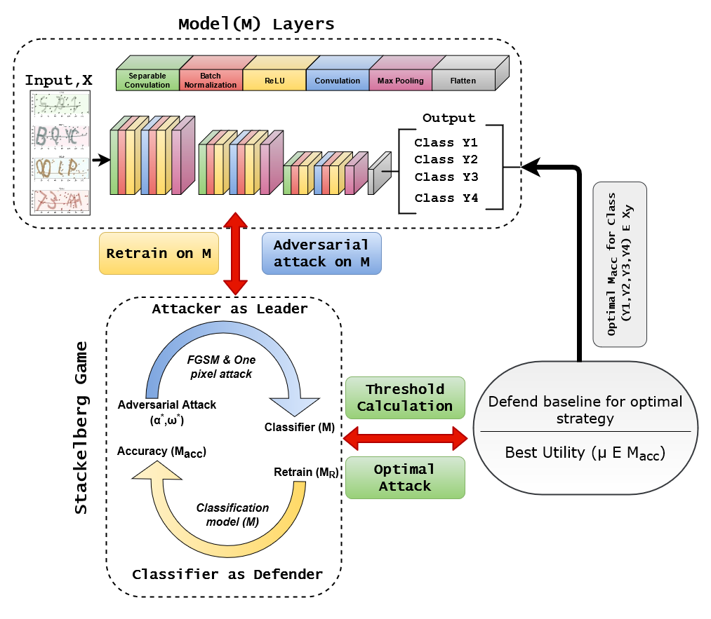

# Game-Theoretical-vulnerability-analysis-of-Adversarial-Attack

### Published Version
```
https://link.springer.com/chapter/10.1007/978-3-031-20716-7_29
```

# Citation
```
@inproceedings{hossain2022game,
  title={A Game Theoretical Vulnerability Analysis of Adversarial Attack},
  author={Hossain, Khondker Fariha and Tavakkoli, Alireza and Sengupta, Shamik},
  booktitle={Advances in Visual Computing: 17th International Symposium, ISVC 2022, San Diego, CA, USA, October 3--5, 2022, Proceedings, Part II},
  pages={369--380},
  year={2022},
  organization={Springer}
}
```


This code is for our paper "Game-Theoretical-vulnerability-analysis-of-Adversarial-Attack" which has been accpeted in ISVC 2022.




## Pre-requisite
- Ubuntu 18.04 / Windows 7 or later
- NVIDIA Graphics card


## Installation Instruction for Ubuntu
- Download and Install [Nvidia Drivers](https://www.nvidia.com/Download/driverResults.aspx/142567/en-us)
- Download and Install via Runfile [Nvidia Cuda Toolkit 10.0](https://developer.nvidia.com/cuda-10.0-download-archive?target_os=Linux&target_arch=x86_64&target_distro=Ubuntu&target_version=1804&target_type=runfilelocal)
- Download and Install [Nvidia CuDNN 7.6.5 or later](https://developer.nvidia.com/rdp/cudnn-archive)
- Install Pip3 and Python3 enviornment
```
sudo apt-get install pip3 python3-dev
```
- Install Tensorflow-Gpu version-2.0.0 and Keras version-2.3.1
```
sudo pip3 install tensorflow-gpu==2.0.0
sudo pip3 install keras==2.3.1
```
- Install packages from requirements.txt
```
sudo pip3 install -r requirements.txt
```
